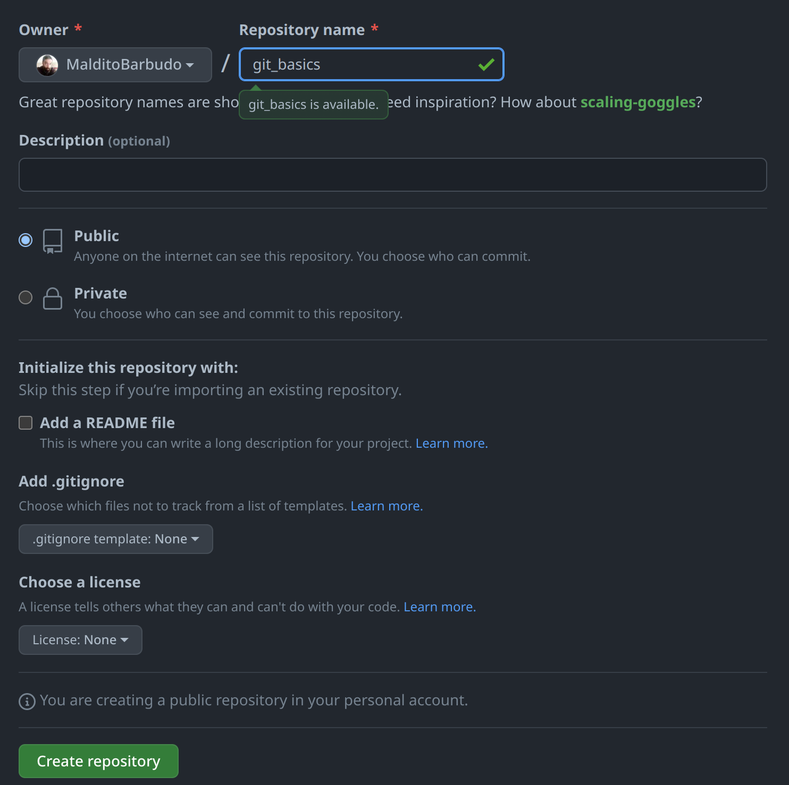

```{r setup, include=FALSE}
knitr::opts_chunk$set(echo = TRUE)
```

## Introduction

`git` is a version control software, not the only one, but one of the most
widely used. But, what is *version control*?  
As the [git book](https://git-scm.com/book/en/v2) explains, version control
systems allow to record the changes a file or a set of files have been through,
allowing to revert files to a previous state, compare changes over time...  
Version control systems, and `git` in particular, are designed with
collaborative development in mind (a team working in the same codebase), but it
doesn't mean it can't be used in *solo* projects, and in fact, is recommended.

  > **Important!! `git` is not a backup system**. Is not intended to be a backup
  system. Think of it more as a time machine for your code, but you should have
  backup copies besides any version control system.

## How `git` works

Think of `git` as a series of snapshots of the files. Every time we `commit`
some changes, an image of the state of the files is stored. This allows to
follow the development of the project (how things changed), but more
importantly, it allows to go back to any point in the `commit` history.  

Let's say that you are performing some analyses in your R project and something
is not working as intended. You try to fix it, but at the end you have made so
many changes to the analysis code that is impossible to revert to the state in
which everything worked again. With `git` you have the history of changes
stored, you can see differences in files you modified, and when you modified it,
and also you can go back easily to any point in that history.

## What is GitHub

GitHub is an online service that allows to have a remote copy of your `git`
repository, making easier synchronising between computers. With GitHub, you
always have an online resource with your work that can be pulled at any time
from any computer you have access. More on this later.

## Basic `git` usage


The `git` workflow is as follows:

  1. You make changes
  1. You `add` and `commit` those changes to `git` history
  1. You `push` your changes to GitHub

If you are developing in two different machines, then GitHub acts as a middleman
for you to be able to get the latest changes you made:

  1. You make changes
  1. You `add` and `commit` those changes to `git` history
  1. You `push` your changes to GitHub
  1. You go on remote work, with your laptop
  1. You `pull` the repository from GitHub
  1. You make changes
  1. You `add` and `commit` those changes to `git` history
  1. You `push` your changes to GitHub
  1. You go back to the office, with your work computer
  1. You `pull` the repository from GitHub
  1. You make changes
  1. You `add` and `commit` those changes to `git` history
  1. You `push` your changes to GitHub

## Working with `git` and GitHub

### Creating a GitHub account

If you don't have a GitHub account yet, go to [github.com](github.com) and
follow the page instructions to create a new account.

  > Important! It's recommended to create the GitHub account with a personal mail. Institutional
  mail addresses come and go, but this way you will be able to access GitHub even if you change
  institutions/companies

### Installing `git`

In Windows, go to https://git-scm.com/download/win and the download will start
automatically. If not, just click the download link.

In Mac, check at https://git-scm.com/download/mac if is not installed already.

In linux, check your package manager (`dnf`, `apt`, `pacman`...) for the
package available for your distribution.

#### Configuring git for our user

After installing `git` and having a GitHub account, we can configure our `git` installation with
our username and mail, that way when we `push` (more on this later) to GitHub things will be easier
to identify the author of the `commit`.
For configuring `git` with our user, we just write in the terminal the following commands:

```
git config --global user.name "MyUser"
git config --global user.email "my@mail.com"
```

### Starting a git repository

#### Command line
In the terminal, at the folder we want to convert to a `git` repository we can
write

```
git init
```

And it will become a version controlled folder.

#### RStudio project

From RStudio, at the moment of creating a new project we need to check the
corresponding checkbox:


If you have already created the project without `git`, you can always go to the
project options (`Tools` menu -> `Project Options...`) and select `git` in the
Git/SVN menu:


### Creating the GitHub repository

To be able to use GitHub with our local `git` repository we just created, we need to create a
*remote* repository in GitHub. For that, we just click in the `New` button in our GitHub profile:


This will lead us to a page in which we indicate the name of the repository (the same as our
project in RStudio) and without anything else, we click in `Create repository` button:



With the GitHub repository created, some instructions appear, we will follow the ones under
`…or push an existing repository from the command line`. We can copy the commands in that section
and paste them to the terminal to link our local repository with the GitHub repository:


Doing this will result in our local repository linked with the GitHub remote one:

```
> git remote add origin https://github.com/MalditoBarbudo/git_basics.git
> git branch -M main
> git push -u origin main

Username for 'https://github.com': MalditoBarbudo
Password for 'https://MalditoBarbudo@github.com': 

Enumerating objects: 22, done.
Counting objects: 100% (22/22), done.
Delta compression using up to 8 threads
Compressing objects: 100% (21/21), done.
Writing objects: 100% (22/22), 315.97 KiB | 9.87 MiB/s, done.
Total 22 (delta 8), reused 0 (delta 0), pack-reused 0
remote: Resolving deltas: 100% (8/8), done.
To https://github.com/MalditoBarbudo/git_basics.git
 * [new branch]      main -> main
branch 'main' set up to track 'origin/main'.
```

And our local contents will be already present in the GitHub repository page:


